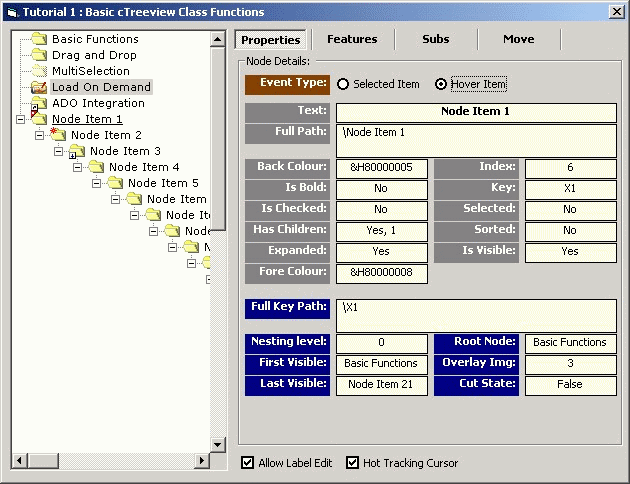



## cTreeView Class wrapper v02\.01\.00 \(Release 4\)

### Description

The award-winning TreeView Class wrapper has been optimised using APIs plus many new features added like simple Drag'n'Drop with auto-expand & auto-scroll, Multi-Node selection, Overlay Icons, load/save to binary/Xml file, and many more... 6 Tutorial applications are included to demonstrate sets of features to help make it easier to understand and implement into your own applications. The Wrapper contains several files that can either be embedded directly in an appplication or compiled into an in-process DLL (by Default). If you're considering working with the TreeView control, then this will be an invaluable tool for you! *** Latest version can be found here:- http://www.planetsourcecode.com/vb/scripts/ShowCode.asp?txtCodeId=37553&lngWId=1 ***
 
### More Info
 
*** Latest version can be found here:- <a href="http://www.planetsourcecode.com/vb/scripts/ShowCode.asp?txtCodeId=37553&lngWId=1">Here!</a>

             |
---                |---
**Submitted On**   |2002-05-04 22:11:44
**By**             |[Slider](https://github.com/Planet-Source-Code/PSCIndex/blob/master/ByAuthor/slider.md)
**Level**          |Intermediate
**User Rating**    |5.0 (295 globes from 59 users)
**Compatibility**  |VB 6\.0
**Category**       |[Custom Controls/ Forms/  Menus](https://github.com/Planet-Source-Code/PSCIndex/blob/master/ByCategory/custom-controls-forms-menus__1-4.md)
**World**          |[Visual Basic](https://github.com/Planet-Source-Code/PSCIndex/blob/master/ByWorld/visual-basic.md)
**Archive File**   |[TreeView\_C79206542002\.zip](https://github.com/Planet-Source-Code/slider-ctreeview-class-wrapper-v02-01-00-release-4__1-34439/archive/master.zip)

### API Declarations

many...

